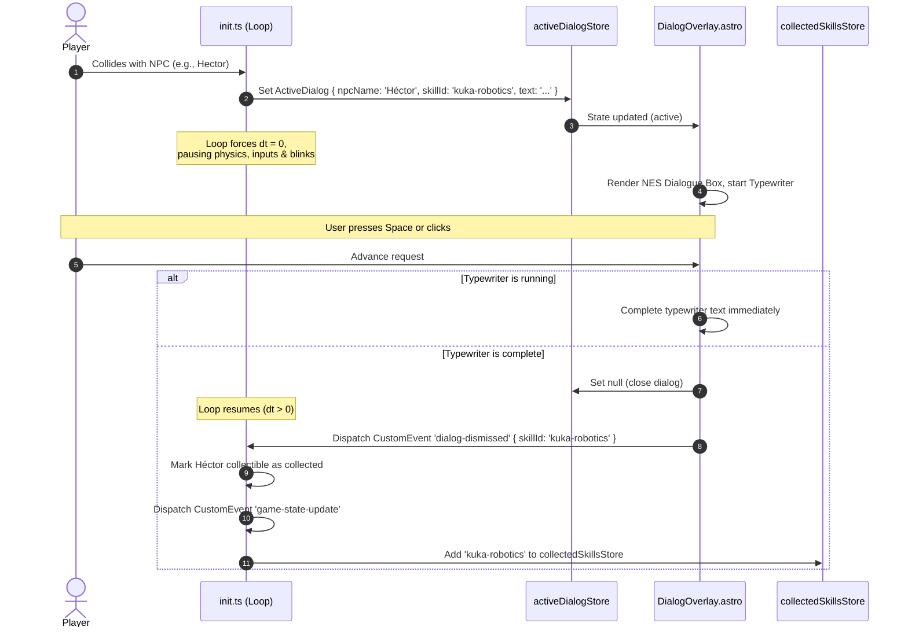

# Design: game-npcs

## Technical Approach

The `game-npcs` change integrates four stationary coworker NPCs (Héctor, Laura, Dani, Marcos) into their respective career biomes in the game map. They replace/augment their corresponding qualitative or technical skill items, providing localized, immersive dialogue interactions.

1. **State Management (`activeDialogStore`)**: A new reactive Nanostore, `activeDialogStore`, in `src/game/store.ts` tracks whether a dialogue overlay is open and holds the current dialogue payload.
2. **NPC Configuration (`SKILL_TEMPLATES`)**: Define `npc` metadata inside `SKILL_TEMPLATES` in `src/game/init.ts`. The metadata specifies the NPC name, their capital initial, and localized dialogue text for Spanish (`es`) and English (`en`).
3. **Canvas Drawing (`render.ts`)**: Update `drawCollectibles` to detect if an item contains `npc` metadata. If present, render a yellow retro circle containing the NPC's initial (centered) and draw their name above the circle.
4. **Engine Pause (`dt = 0`)**: The update loop in `src/game/init.ts` subscribes to `activeDialogStore`. When populated, all game physics updates, trail progressions, input checks, and spritesheet animations freeze by overriding delta-time (`dt = 0`) and disabling active player blink ticks, while keeping the rendering loop alive.
5. **Decoupled Progression (`DialogOverlay.astro`)**: Mount a client-side reactive dialog HUD overlay at the bottom of the screen. When `activeDialogStore` is active, it runs a progressive typewriter animation. A Space keydown or overlay click advances or completes the text, nullifies `activeDialogStore`, and dispatches `'dialog-dismissed'`.
6. **Decoupled Collection**: The engine's `init.ts` listens for `'dialog-dismissed'`. It marks the corresponding skill collectible as collected and dispatches `game-state-update` to trigger the standard HUD bag unlocking callbacks.

## Architecture Decisions

| Decision                  | Option                                              | Tradeoff                                                                                                                                       | Decision                                                                                                                                   |
| ------------------------- | --------------------------------------------------- | ---------------------------------------------------------------------------------------------------------------------------------------------- | ------------------------------------------------------------------------------------------------------------------------------------------ |
| **State Sharing**         | CustomEvent vs Nanostore                            | CustomEvents are isolated but difficult to sync with UI component mounting/rendering states. Nanostores allow instant reactivity in Astro.     | **Nanostore (`activeDialogStore`)** for reactive UI rendering, and **CustomEvent (`dialog-dismissed`)** to trigger engine-side collection. |
| **Dialogue Localization** | Client-side interpolation vs Store-level resolution | Interpolating on the client requires passing all language pairs. Store-level resolution filters the correct string in the engine on collision. | **Store-level resolution** within the engine, resolving text based on the engine's initialized locale.                                     |
| **Blink & Anim Freeze**   | Pause whole loop vs Selective freeze (`dt=0`)       | Pausing the loop stops all canvas rendering. Selective freeze retains drawing but locks physics/animations.                                    | **Selective freeze (`dt = 0`)** with static drawing active, ensuring player/blink stay frozen but visible.                                 |

## Data Flow

```
Player Collides with NPC ──→ Set activeDialogStore (with localized text) ──→ Pause Loop (dt=0)
                                                                                  │
  Astro HUD Updates (collectedSkills) ←── dialog-dismissed Event 🗴── DialogOverlay (Typewriter)
```

## Sequence Diagram



## Interfaces / Contracts

### `src/game/types.ts`

```typescript
export interface NPCMetadata {
  name: string;
  initial: string;
  dialogue: {
    es: string;
    en: string;
  };
}

export interface ActiveDialog {
  npcName: string;
  skillId: string;
  text: string;
}

export interface CollectibleItem {
  id: string;
  name: string;
  category: 'technical' | 'qualitative' | 'soft';
  biome: string;
  x: number;
  y: number;
  radius: number;
  collected: boolean;
  npc?: NPCMetadata; // Added
}

export interface InitOptions {
  gridSize?: number;
  friction?: number;
  acceleration?: number;
  deadzone?: number;
  spritesheetPath?: string;
  locale?: 'es' | 'en'; // Added
}
```

### `src/game/store.ts`

```typescript
import { atom } from 'nanostores';
import type { ActiveDialog } from './types';

export const isStartedStore = atom<boolean>(false);
export const volumeStore = atom<number>(70);
export const gamepadConnectedStore = atom<boolean>(false);
export const collectedSkillsStore = atom<string[]>([]);
export const activeDialogStore = atom<ActiveDialog | null>(null); // Added
```

## Adherence to DevXoje Criteria

- **No Magic Strings**: Colors and styling properties are extracted to named constants at the top of files:
  - `render.ts`: `const NPC_FILL = 'rgba(253, 224, 71, 0.25)'`, `const NPC_STROKE = '#eab308'`, `const NPC_NAME_COLOR = '#ffffff'`, `const NPC_INITIAL_COLOR = '#ffffff'`.
  - `DialogOverlay.astro`: Typewriter speed (`const CHAR_SPEED_MS = 30`), layout class names, and layout dimensions are managed as constants.
- **Centralized Translations**: The dialogue instruction labels are added to `ui.es.json` / `ui.en.json` (key: `"dialogContinue"`).
- **HTML Data Attributes**: `DialogOverlay.astro` passes the localized button copy dynamically using `data-continue-label={ui.game.dialogContinue}` and retrieves it client-side.

## Testing Strategy

| Layer           | What to Test                                                                          | Approach                                                                                                                                                                              |
| --------------- | ------------------------------------------------------------------------------------- | ------------------------------------------------------------------------------------------------------------------------------------------------------------------------------------- |
| **Unit**        | Store initialization and updates. NPC metadata presence in `SKILL_TEMPLATES`.         | Assert `activeDialogStore` starts as `null` and accepts updates. Assert that 4 specific skills have valid `npc` metadata.                                                             |
| **Integration** | Engine freezing and collision behavior.                                               | In a virtual loop context, assert that colliding with an NPC sets `activeDialogStore` and forces `dt = 0`. Assert `'dialog-dismissed'` resumes the loop and marks the item collected. |
| **Manual / UI** | Visual layout of NES dialogue box, typewriter animation, and Space/click progression. | Launch the local server via `pnpm dev`, collide with each of the 4 NPCs, verify visual rendering and typewriter speed, and test Space key/mouse click progression.                    |

## Threat Matrix

`N/A — no routing, shell, subprocess, VCS/PR automation, executable-file classification, or process-integration boundary.`

## Migration / Rollout

No database migration required. Fully backward compatible; collectibles without the optional `npc` field continue to render and behave as standard skill coins.
