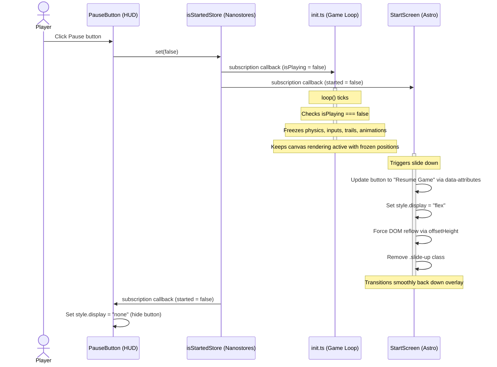

# Design: Game Pause

## Technical Approach

We will integrate gameplay pause using `isStartedStore` as the single source of truth. The engine in `src/game/init.ts` subscribes to this store to control loop state calculations. On pause (`isStartedStore === false`), calculations freeze while drawing continues. The HUD `PauseButton.astro` triggers pause, and `StartScreen.astro` handles sliding back down on pause with reflow management and localized label toggling.

## Architecture Decisions

| Option                                 | Tradeoff                                                                                                 | Decision                                                                                                      |
| -------------------------------------- | -------------------------------------------------------------------------------------------------------- | ------------------------------------------------------------------------------------------------------------- |
| **Reactive Store in Engine**           | Simple subscription in `init.ts`, but must unsubscribe in `stop()` to prevent memory leaks.              | **Chosen**. Provides robust synchronization between gameplay UI overlay and engine without duplicating state. |
| **Manual Engine API Toggling**         | Imperative `pause()`/`resume()` on game handle, but risks state mismatch if UI and engine desynchronize. | **Rejected**. Increases UI-engine coupling and state duplication.                                             |
| **Animation Freezing with Delta Time** | Pass `0` elapsed time to `playerEntity.updateAndDraw` on pause.                                          | **Chosen**. Elegant way to halt animation frames without modifying rendering logic.                           |

## Data Flow

### Sequence Diagram: Pause Interaction



## File Changes

| File                                    | Action | Description                                                                                                                                              |
| --------------------------------------- | ------ | -------------------------------------------------------------------------------------------------------------------------------------------------------- |
| `src/i18n/ui.es.json`                   | Modify | Add `"pauseButton": "Pausa"` and `"resumeGame": "Reanudar Juego"`.                                                                                       |
| `src/i18n/ui.en.json`                   | Modify | Add `"pauseButton": "Pause"` and `"resumeGame": "Resume Game"`.                                                                                          |
| `src/game/init.ts`                      | Modify | Subscribe to `isStartedStore`, track unsubscribe handle, freeze updates when `isPlaying` is false, and pass `0` delta-time to `updateAndDraw`.           |
| `src/components/game/StartScreen.astro` | Modify | Handle pause transition: set display to flex, trigger DOM reflow via `offsetHeight` before removing `.slide-up`, and localize label via data attributes. |
| `src/components/game/PauseButton.astro` | Create | New retro-styled HUD Pause button component. Toggles visibility on `isStartedStore`.                                                                     |
| `src/pages/[locale]/index.astro`        | Modify | Import and mount `<PauseButton locale={locale} />` inside HUD layouts.                                                                                   |

## Interfaces / Contracts

No new store structures are needed. The existing `isStartedStore` is utilized:

```typescript
// src/game/store.ts
export const isStartedStore = atom<boolean>(false);
```

We introduce `isPlaying` in the engine `init.ts`:

```typescript
// src/game/init.ts (inside init function)
let isPlaying = false;
const unsubscribe = isStartedStore.subscribe((isStarted) => {
  isPlaying = isStarted;
});
```

## Testing Strategy

| Layer       | What to Test            | Approach                                                                                                             |
| ----------- | ----------------------- | -------------------------------------------------------------------------------------------------------------------- |
| Unit        | Engine `stop()` cleanup | Verify that the unsubscribe handler of `isStartedStore` is invoked on `stop()`.                                      |
| Integration | Engine Pause behavior   | Mock `isStartedStore` state, verify player velocity and trail updates freeze while canvas rendering continues.       |
| Integration | StartScreen transition  | Verify display styles, forced reflow via `offsetHeight`, and button label replacement under English/Spanish locales. |

## Threat Matrix

`N/A — no routing, shell, subprocess, VCS/PR automation, executable-file classification, or process-integration boundary.`

## Migration / Rollout

No data migration required. Automated rollback plan is provided in proposal.

## Adherence to DevXoje Criteria

To ensure no magic strings or bypasses, the following constants will be strictly declared:

```typescript
// StartScreen.astro
const CLASS_SLIDE_UP = 'slide-up';
const DISPLAY_FLEX = 'flex';
const DISPLAY_NONE = 'none';
const TRANSITION_PROPERTY = 'transform';
```

Translation strings are retrieved dynamically via HTML data-attributes:

```astro
<!-- StartScreen.astro -->
<div
  id="start-screen"
  class="no-print"
  data-start-label={ui.game.startGame}
  data-resume-label={ui.game.resumeGame}
>
</div>
```
